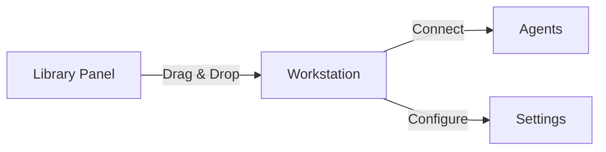

# Dotbase
<div align="center">


**Create agent-based workforces with drag-and-drop simplicity**

[Website](https://dotbase.ai) • [Documentation](https://dotbase.gitbook.io/dotbase)

</div>

---

## 🚀 Overview

Dotbase is a powerful low-code platform that transforms how you build AI agent workforces. With our intuitive drag-and-drop interface, create sophisticated agent networks and export them as production-ready Python code.

## ✨ Key Features

### 🎨 **Visual Development**
- **Drag-and-Drop Interface**: Effortlessly design complex multi-agent workflows with an intuitive UI.
- **Interactive Canvas**: Organize agents, set connections, and define logic in a visual environment.
- **No-Code Logic Configuration**: Modify agent behaviors, triggers, and responses without writing a single line of code.

### 🔳 **Code Export**
- **Production-Ready Python Code**: Automatically convert visual workflows into executable Python scripts.
- **Autogen-Based Agent Framework**: Ensure seamless compatibility with Microsoft’s Autogen library.
- **Editable and Extendable**: Modify exported scripts for additional customization.

### 🛠️ **Custom Integration**
- **Support for External APIs**: Connect agents to third-party tools, databases, and cloud services.
- **Custom Functions**: Extend agent capabilities with Python functions and NovaMind Assistant API.
- **Modular Plugin Support**: Easily integrate additional tools for domain-specific tasks.

### 📊 **Real-time Testing & Debugging**
- **Live Execution Preview**: Run workflows in real time and observe agent interactions.
- **Event Logging & Monitoring**: Track agent performance, interactions, and message exchanges.
- **Error Handling & Debugging**: Identify issues and optimize workflow efficiency.

### 🔒 **Enterprise Security**
- **Bank-Grade Encryption**: Ensure data privacy with industry-standard encryption techniques.
- **Access Control & Permissions**: Define user roles and restrict access to sensitive operations.
- **Secure API Communication**: Implement secure authentication and encrypted data transfers.

## 🏰 Architecture

### Agents

Our Autogen-based system supports four core components:

| Agent Type | Description |
|------------|-------------|
| `Nexus` | Configurable AI agents with custom system prompts |
| `Lumina` | OpenAI Assistant API integration with custom function support |
| `Bridge` | Human-agent interaction interface |
| `Hub` | Multi-agent collaboration hub |

### Tools

`Spark`
- Integrate Python functions
- Connect OpenAI Assistant functions
- Add custom capabilities

## 💻 Workstation

### Node Operations



- **Add**: Drag components from Library Panel
- **Connect**: handles indicate compatible connections
- **Delete**: Press del / back-space key 

## 🚀 Deployment

### Local Setup

```bash
# Install dependencies
pip install pyautogen

# Run exported script
python dotflow.py
```

### Replit Deployment

1. Create Python project
2. Add to `pyproject.toml`:
   ```toml
   [tool.poetry.dependencies]
   pyautogen = "0.2.7"
   ```
3. Run your exported script

## 📄 License

[MIT License](LICENSE)

## 🌟 Support

- Documentation: [docs.dotbase.ai](https://dotbase.gitbook.io/dotbase)

---

<div align="center">
Made with ❤️ by Dotbase Team
</div>

